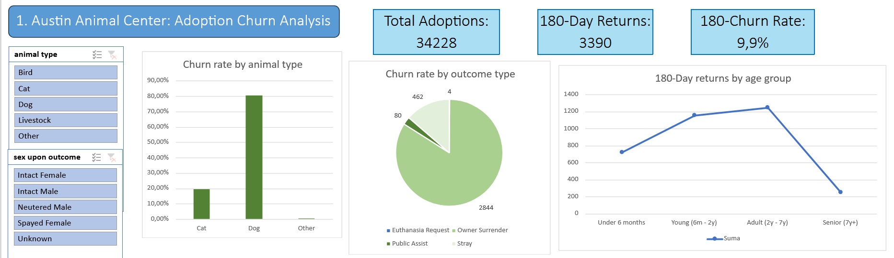
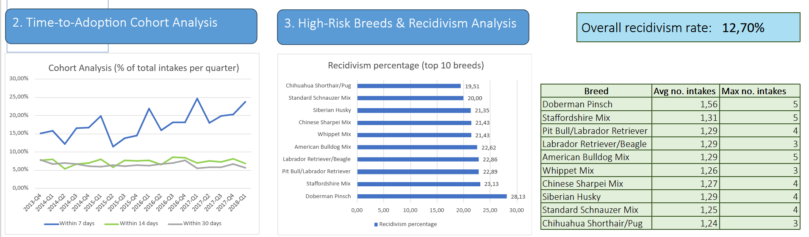
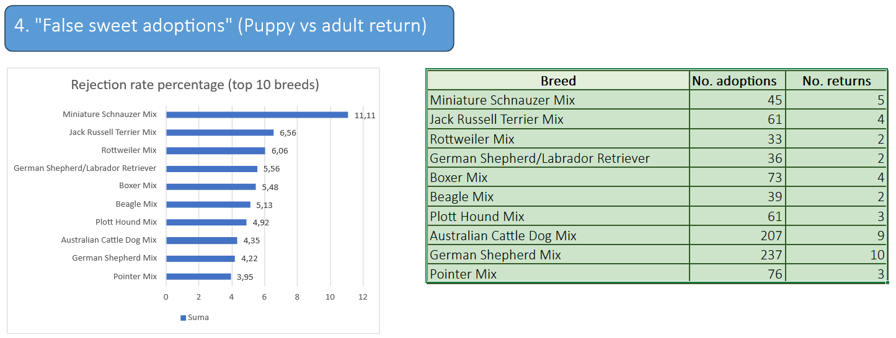

# Austin Animal Center: Data-Driven Shelter Management
End-to-end data analysis project exploring animal shelter churn rates and high-risk adoption patterns using PostgreSQL and Excel dashboards.





### Project Overview 
This project leverages SQL and MS Excel to analyze over 160,000 intake and outcome records from the Austin Animal Center. The main objective was to identify the root causes of adoption failures (churn), track adoption velocity over time, and highlight high-risk dog breeds prone to recidivism and adult returns.

### Data Source
The data used for this analysis originates from the official **Austin Animal Center** database, made available via Kaggle. The dataset was split into two primary tables both containing over 80,000 records:
* **`intakes`**: Logs of animals entering the shelter (including date, condition, animal type, and age upon intake).
* **`outcomes`**: Logs of animals leaving the shelter (including date, outcome type e.g., Adoption/Transfer, and age upon outcome).

### Business Questions Addressed
This project was structured around answering four critical operational questions for the shelter:
1. **Adoption Churn Analysis:** What percentage of adopted animals are returned to the shelter within a 6-month (180-day) window, and what key characteristics (e.g., age group, intake type) drive this churn?
2. **Time-to-Adoption (Velocity) Cohorts:** What percentage of animals admitted in a given quarterly cohort are successfully adopted within 7, 14, and 30 days of intake, and has this adoption velocity improved year-over-year?
3. **Breed Recidivism Rates:** What is the overall return rate, and which statistically significant dog breeds (cohorts of ≥ 30 unique individuals) exhibit the highest recidivism rate (coming to the shelter 2 or more times)? Furthermore, what are the average and maximum number of intakes per dog within these high-risk groups?
4. **"False Sweet Adoptions" (The Puppy Effect):** Which statistically significant dog breeds have the highest percentage of failed puppy adoptions—specifically defined as dogs adopted at under 6 months of age, but subsequently returned to the shelter as adults (≥ 1 year old)?

### Key Findings & Business Recommendations

* **1. The 180-Day Churn Problem (9.9% Overall)**
* Insight: Out of 34,228 total adoptions, 3,390 animals were returned to the shelter within half a year, establishing a baseline churn rate of 9.9%. Dogs make up the vast majority of these returns (~80%) compared to cats, with "Owner Surrender" being the primary reason. Age also plays a crucial role: "Adult" and "Young" dogs face the highest return rates.
  * *Recommendation:* Implement a targeted post-adoption support program (e.g., behavioral helplines, free basic training) specifically for adopters of adult and young dogs, proactively reaching out before an "Owner Surrender" decision is made.

* **2. Adoption Velocity Trends**
  * Insight: Cohort analysis spanning from Q4 2013 to Q1 2018 indicates that the majority of successful adoptions happen very quickly — within the first 7 days of intake. 
  * *Recommendation:* Capitalize on this critical 7-day window. If an animal is not adopted within the first two weeks, they should be automatically flagged for special marketing efforts (e.g., featured social media posts) to prevent long-term shelter stays.

* **3. High-Risk Recidivism Breeds (12.7% Overall Rate)**
  * Insight: While the overall recidivism rate is 12.7%, certain breeds drastically exceed this average. The Doberman Pinsch leads with a return rate of over 28%, followed by the Staffordshire Mix (~23%). Some extreme cases show individual dogs returning to the shelter up to 5 times.
  * *Recommendation:* Require potential adopters of high-risk breeds (Doberman, Staffordshire, Pit Bull mixes) to undergo a mandatory counseling session or handling class prior to finalizing the adoption to ensure they are prepared for the breed's specific needs.

* **4. The "False Sweet Adoption" Phenomenon**
  * Insight: Adopting puppies is easy, but keeping them is harder. The Miniature Schnauzer Mix leads with an 11.11% rejection rate (5 returns out of 45 puppy adoptions), followed by the Jack Russell Terrier Mix (6.56%).
  * *Recommendation:* Create specific educational materials for adopters of terrier and schnauzer mixes, clearly outlining the expected adult energy levels, behavioral traits, and grooming requirements to manage expectations *before* the puppy grows up.

### Tools & Techniques Applied
* **SQL (PostgreSQL):** Used for heavy data lifting. Leveraged complex aggregations combined with conditional logic (`CASE WHEN`) to calculate precise churn rates and recidivism percentages. Applied Window Functions to rank intake/outcome events, CTEs for readability, and `EXISTS` subqueries optimized with Indexes for complex behavioral tracking (e.g., puppy vs. adult returns).
* **MS Excel:** Used for final data modeling, interactive dashboard creation (Pivot Tables, Slicers), and visual storytelling.
* **Data Cleaning:** Standardized inconsistent ISO 8601 timestamps and parsed text-based age strings into precise numeric values.

### SQL Highlight 
The most technically demanding query in the project was the Churn Analysis (Q1). The core challenge: for each adoption event, find the single next intake event for the same animal — if it occurred within 180 days. A naive JOIN would produce a many-to-many explosion. The solution was a ROW_NUMBER() window function partitioned by both animal_id and adoption_date, ordering by the next intake timestamp ascending — isolating exactly one row per adoption:

WITH FutureIntakes AS (
    SELECT
        o.animal_id,
        o.datetime        AS adoption_date,
        i.datetime        AS next_intake_date,
        i.intake_type     AS return_type,

        ROW_NUMBER() OVER(
            PARTITION BY o.animal_id, o.datetime
            ORDER BY i.datetime ASC
        ) AS event_rank

    FROM outcomes o
    LEFT JOIN intakes i
        ON  o.animal_id = i.animal_id
        AND i.datetime  > o.datetime
    WHERE o.outcome_type = 'Adoption'
 )

Full queries for all four analyses are available in the /sql folder.


### Technical Rationale: Why SQL + Excel?
The division of labor between PostgreSQL and Excel in this project was a deliberate architectural choice, not a matter of preference.
Why PostgreSQL for the analytical core:
Each of the four business questions required a fundamentally different relational strategy, which is precisely why they were separated into four independent queries rather than forced into one monolithic CTE chain. This makes each analytical unit independently testable and easier to audit.

* **Churn Analysis (Q1)** required a self-referencing temporal JOIN — matching each adoption event for a given animal_id to the next intake event that occurred strictly after it. This kind of row-to-row comparison across 80,000+ records is not feasible in Excel without array formulas that would crash the application. ROW_NUMBER() OVER(PARTITION BY animal_id, adoption_date ORDER BY next_intake_date) was the natural solution, cleanly isolating the single most relevant return event per adoption.
* **Cohort Velocity Analysis (Q2)** required grouping animals by quarterly intake cohort and then classifying each animal's adoption speed as a categorical bucket (7 / 14 / 30 days). The challenge here was that a single intake record needed to be joined to its first subsequent outcome — again a temporal ordered JOIN that Excel cannot handle reliably at this scale.
* **Breed Recidivism (Q3)** was structurally simpler but required careful handling of the statistical threshold: only breeds with ≥ 30 unique individuals were included (HAVING COUNT(animal_id) > 30) to avoid misleading percentages from small samples — a deliberate methodological choice to ensure the findings are actionable rather than anecdotal.
* **"False Sweet Adoptions" (Q4)** introduced a correlated EXISTS subquery to check, for each puppy adoption, whether that specific animal later re-entered the shelter as an adult (age ≥ 1 year). To prevent performance degradation on a large dataset, dedicated indexes were created on animal_id in both tables prior to execution — reducing lookup complexity from a full sequential scan to an index scan.

**Why Excel for the final mile:**
Once PostgreSQL flattened the complex relational logic into clean, aggregated CSV outputs, Excel became the right tool — not because it is more powerful, but because it is more accessible. The goal of the dashboard layer was to produce something a non-technical shelter manager could open, filter with a slicer, and act on immediately. Pivot Tables and conditional formatting serve that communication goal better than any SQL result set ever could.

### Repository Structure

```
📁 austin-animal-center-analysis/
├── 📁 sql/
│   ├── 00_data_preparation.sql
│   ├── 01_churn_analysis.sql
│   ├── 02_adoption_cohorts.sql
│   ├── 03_recidivism_rates.sql
│   └── 04_false_sweet_adoptions.sql
├── 📁 results/
│   ├── 01_churn_results.csv
│   ├── 02_adoption_cohorts_results.csv
│   ├── 03_recidivism_rates_results.csv
│   └── 04_puppy_effect_results.csv
├── 📁 excel/
│   ├── Austin_Animal_Shelter_Data_Analysis.xlsx
│   └── dashboard.pdf
├── 📁 dashboard/
│   ├── dashboard_part1.png
│   ├── dashboard_part2.png
│   └── dashboard_part3.png
├── 📁 data/
│   └── README_data.txt
└── README.md
```
